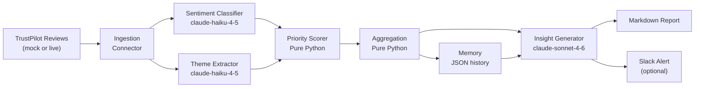

# ecom-feedback-intelligence

A multi-agent pipeline that ingests customer feedback from eCommerce platforms and transforms it into structured, PM-ready insights using the Anthropic Claude API.

Built as a portfolio project demonstrating applied AI engineering for product teams. Designed to be dropped into any eCommerce brand by swapping a single config file.

---

## What it does



**Pipeline steps:**
1. **Ingest** — Load reviews from TrustPilot (mock mode ships out of the box; real API is a config toggle)
2. **Classify** — Sentiment and theme extraction per review using `claude-haiku-4-5` with forced `tool_use`
3. **Score** — Deterministic priority scoring (no LLM — rating × sentiment weight × recency)
4. **Aggregate** — Theme frequency, sentiment distribution, surface high-priority issues
5. **Synthesise** — `claude-sonnet-4-6` generates PM-structured recommendations with effort/impact estimates
6. **Output** — Dated markdown report + optional Slack message

---

## Design decisions

### tool_use with forced tool_choice
Every LLM call uses `tool_choice={"type": "tool", "name": "..."}` to force structured output. This guarantees schema compliance without regex or JSON parsing — the tool block input is already a typed dict.

```python
response = client.messages.create(
    model="claude-haiku-4-5",
    tools=[SENTIMENT_TOOL],
    tool_choice={"type": "tool", "name": "classify_sentiment"},  # guaranteed structured output
    messages=[...]
)
result = next(b for b in response.content if b.type == "tool_use").input
```

### Two-tier model selection
Haiku processes every review (cheap, fast). Sonnet synthesises once at the end (quality where it matters).

| Step | Model | Why |
|------|-------|-----|
| Sentiment classification | `claude-haiku-4-5` | ~$0.00025/1K tokens, runs per review |
| Theme extraction | `claude-haiku-4-5` | Same — bulk processing |
| Insight generation | `claude-sonnet-4-6` | Runs once; quality and reasoning matter |

**Estimated cost per run (100 reviews): ~$0.02**

### Priority scorer has no LLM
`skills/priority_scorer.py` uses a deterministic formula: `base_score × sentiment_weight × confidence × recency`. Not every step needs AI — this is cheaper, faster, and its logic is auditable.

### Config-driven theme taxonomy
The theme classifier's enum is populated at runtime from `config/brand.yaml`. Claude cannot tag a theme that isn't in the brand's taxonomy. Swapping `brand.yaml` adapts the entire pipeline to a new brand.

### Mock mode by default
The TrustPilot connector defaults to reading from a local JSON file. Anyone cloning this repo can run the full pipeline without API keys for the data source. Real API access is a `NotImplementedError` stub with documented implementation notes.

---

## Quickstart

```bash
# 1. Clone and install
git clone https://github.com/jackhendon/ecom-feedback-intelligence
cd ecom-feedback-intelligence
pip install -r requirements.txt

# 2. Set up credentials
cp .env.example .env
# Edit .env — add your ANTHROPIC_API_KEY

# 3. Test without any API calls
python -m agents.orchestrator --dry-run

# 4. Run the full pipeline (uses synthetic sample data by default)
python -m agents.orchestrator

# 5. Find your report
ls outputs/reports/
```

---

## Adapting for your brand

1. Edit `config/brand.yaml`:
   - Set `brand.name` to your brand
   - Update `themes` to match your product/experience taxonomy
   - Adjust `sentiment.weights` if you want to change urgency scoring

2. Replace `data/examples/trustpilot_sample.json` with your own reviews in the same format, or implement `_fetch_from_api()` in `agents/ingestion/trustpilot.py`.

3. Toggle `reporting.slack_enabled: true` in `brand.yaml` and add your `SLACK_WEBHOOK_URL` to `.env`.

---

## Project structure

```
ecom-feedback-intelligence/
├── config/brand.yaml              # Brand config — swap this to use for any brand
├── data/examples/                 # Synthetic sample data (not real customer data)
├── agents/
│   ├── orchestrator.py            # Pipeline runner
│   └── ingestion/trustpilot.py   # Connector (mock + real API stub)
├── skills/
│   ├── sentiment_classifier.py   # Haiku + tool_use → sentiment
│   ├── theme_extractor.py        # Haiku + tool_use → themes (config-constrained)
│   ├── priority_scorer.py        # Pure Python priority scoring (no LLM)
│   └── insight_generator.py     # Sonnet + tool_use → PM recommendations
├── prompts/                       # Prompt templates (loaded from .txt files)
├── outputs/
│   ├── markdown_reporter.py      # Writes dated .md report
│   └── slack_reporter.py        # Optional Slack webhook
└── memory/history.json           # Rolling 12-week trend data (gitignored)
```

---

## Running tests

```bash
python -m pytest tests/ -v
```

Tests use `unittest.mock` — no API calls or credentials needed.

---

## Future roadmap

- **Phase 2**: Additional sources — Google Reviews, on-site NPS widget, Zendesk support tickets
  - Each will implement the same `Connector` interface as `TrustPilotConnector` — multi-source is a 2-line change in the orchestrator
- **Phase 3**: Trend alerting — Slack alert when `sentiment_trend == "declining"` for 2+ consecutive periods
- **Phase 4**: Competitor benchmarking — run against competitor brand reviews, compare theme distributions

---

## About

Built by [Jack Hendon](https://github.com/jackhendonpapier), Senior Product Manager at Papier.

All data in this repository is **synthetic**. No real customer data is included. The project is designed to be used with anonymised or publicly available reviews only.
